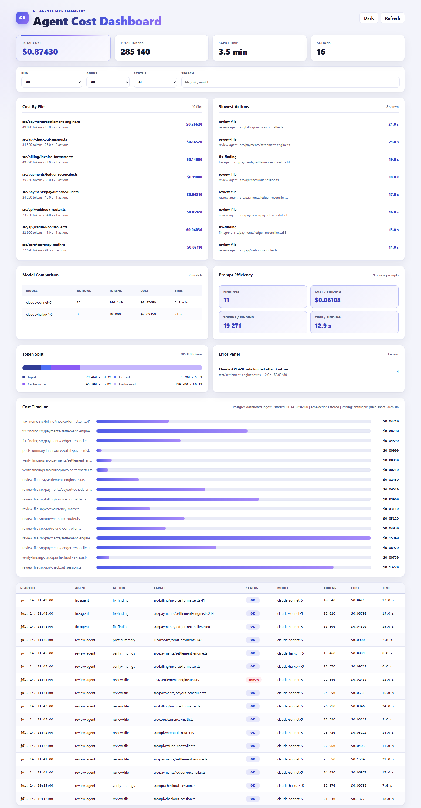
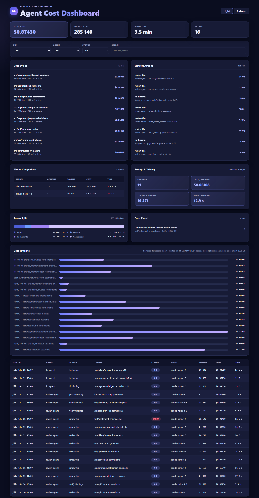

# GitAgents

AI code review, fix suggestions and an optional merge gate for **GitLab merge requests and GitHub pull requests** — one codebase, both platforms.



Every run streams its token usage and cost to a live dashboard, so you always know what the bot costs you.

---

## What it does

On every merge request / pull request, GitAgents:

1. **Reviews the diff** against rules you own (`config/rules/*.md`), with the surrounding file as context.
2. **Verifies its own findings.** A second, adversarial pass tries to *refute* every finding, with read-only access to the repository. Anything it cannot demonstrate from the code is demoted or dropped.
3. **Posts what survives** as inline comments, plus one summary comment that it edits in place across runs.
4. **Suggests fixes** as native one-click suggestion blocks. It does not push commits by default.
5. **Reports to a gate job** that is advisory by default — it tells you what it found and lets you merge.

The design goal is a bot you can leave switched on: quiet when it has nothing useful to say, and never the reason you cannot merge.

## Why it is not noisy

A review bot lives or dies on false positives, so precision is enforced in code rather than requested in a prompt:

- **The model does not decide what blocks.** A finding can only block a merge when it is an error, high-confidence, raised by a rule explicitly marked `gate: true`, *and* confirmed by the verification pass. All four conditions are checked in code.
- **The verifier is adversarial and evidence-based.** It gets read-only `read_file` and `search_repo` tools over the checkout, so it can settle a claim by reading the callee or finding the guard instead of guessing. If verification fails for any reason, findings are kept as they were — it can never invent a blocker.
- **Deterministic checks stay deterministic.** Mechanical findings (merge-conflict markers, focused tests, stray `debugger`) are verified in code and cannot be argued away by a model.
- **Comments are deduplicated across runs.** Every comment carries a hidden fingerprint keyed on the flagged code, so new commits do not repost the same remarks, and a finding that merely moved down the file is not reported "fixed" and then raised again.
- **Inline volume is capped.** The highest-priority findings are posted inline; the rest are listed in the summary.

The model is never given a tool that acts — see [ADR 0001](docs/adr/0001-read-only-tools-no-agent-sdk.md) for why every side effect stays in deterministic code.

## Modes

| `GITAGENTS_GATE_MODE` | Behaviour |
|---|---|
| `advisory` *(default)* | The gate runs and reports; it never blocks a merge. |
| `block` | Verified blocking findings fail the check. Pair with a required status / merge check. |
| `off` | No gate job. |

| `GITAGENTS_FIX_MODE` | Behaviour |
|---|---|
| `suggest` *(default)* | Fixes are posted as one-click suggestion comments. Nothing is committed. |
| `push` | The bot commits and pushes fixes to the source branch. |
| `off` | No fix job. |

Labels: `skip-review` (skip everything), `skip-auto-fix` (no fix job), `skip-gate` (accept the findings and merge anyway).

## Setup

GitAgents runs from its own checkout, so a consuming project only adds a CI entry point. It works whether GitAgents itself is hosted on GitHub or GitLab, and whether the project under review is on GitHub or GitLab.

**Secrets**: `CLAUDE_API_KEY`, plus a token for the platform under review (`GH_PAT` on GitHub, `GITLAB_TOKEN` on GitLab). In suggest mode that token needs API/comment scope only — no repository write access.

### GitHub pull requests

```yaml
# .github/workflows/code-review.yml
name: Code Review
on: pull_request

jobs:
  gitagents:
    uses: <owner>/GitAgents/.github/workflows/gitagents.yml@master
    secrets:
      CLAUDE_API_KEY: ${{ secrets.CLAUDE_API_KEY }}
      GH_PAT: ${{ secrets.GH_PAT }}
    # with:
    #   gate_mode: block
    #   fix_mode: suggest
```

### GitLab merge requests

```yaml
# .gitlab-ci.yml
include:
  - remote: 'https://raw.githubusercontent.com/<owner>/GitAgents/master/.gitlab-ci.yml'

variables:
  GITAGENTS_SOURCE_REPO: "https://github.com/<owner>/GitAgents.git"
```

Set `CLAUDE_API_KEY` and `GITLAB_TOKEN` as masked CI/CD variables.

## Tuning it for your project

**Rules** live in `config/rules/` as markdown. Each rule declares its severity and whether it may ever gate a merge:

```markdown
## null-safety
severity: error
gate: true

Flag a dereference of a value that can be null on a path visible in this diff.
Do not flag a value that is already checked, or one whose nullability you cannot see.
```

Only rules with `gate: true` can block, and only after verification. A new rule is non-blocking unless you opt in.

**Per-project context** goes in `review-context.json` at the root of the project under review:

```json
{
  "suppressions": [
    { "ruleId": "console-log", "pathPattern": "scripts/**", "reason": "CLI output is intentional" }
  ],
  "notes": [
    { "text": "Generated clients under src/api/generated are not reviewed." }
  ]
}
```

Suppressions are enforced in code, so a suppressed finding can never reach the gate.

**Knobs**: `GITAGENTS_MAX_INLINE_COMMENTS` (default 15), `REVIEW_API_TIMEOUT`, `GITAGENTS_DASHBOARD_URL`, `GITAGENTS_TELEMETRY=0`.

## Layout

```
packages/
  core/          Types, rule loading, Claude client, telemetry
  forge/         Platform port: one interface, GitLab + GitHub adapters
  review-agent/  Diff review, static checks, verification, comment reconciliation
  fix-agent/     Fix generation, patch validation, suggestion comments
  dashboard/     Live token/cost dashboard
config/          Rules and reviewer tone — edit these, not the prompts
```

Every platform call lives in `forge`. The agents never talk to GitLab or GitHub directly, and every mutating call — comments, threads, labels, commits — is made by ordinary code. The model is only ever handed read-only tools.

## Dashboard

```bash
npm run dashboard
```

Point the agents at it with `GITAGENTS_DASHBOARD_URL` and it shows cost per file, slowest actions, token split, cost per finding and failures, in a light and a dark theme.



## Development

```bash
npm install
npm run build
npm test
```
